# 🏔️ HIKARI GROUP

**PropTech · Immobilier · Hospitalité · Intelligence Artificielle**

---

## 🎯 Mission

Construire l'écosystème de référence pour l'investissement immobilier intelligent, propulsé par l'IA et les données ouvertes.

## 🏗️ L'Écosystème HIKARI

```mermaid
graph TD
    subgraph "HIKARI GROUP"
        GROUP[🏔️ HIKARI GROUP<br/>Holding & Stratégie]
        CAPITAL[💰 HIKARI CAPITAL<br/>Investissement immobilier]
        STAYS[🏨 HIKARI STAYS<br/>Hôtellerie & Airbnb]
        TECH[💻 HIKARI TECHNOLOGY<br/>SaaS & IA]
    end
    GROUP --> CAPITAL
    GROUP --> STAYS
    GROUP --> TECH
    TECH --> SAAS[📊 SaaS d'analyse<br/>immobilière]
    TECH --> AI[🤖 Agents IA]
    TECH --> DATA[📦 Open Data]
```

## 📦 Dépôts Publics

| Repository | Description | Tech |
|---|---|---|
| [hikari-design-system](https://github.com/HIKARI-GROUP/hikari-design-system) | Système de design React + Tailwind | React, TypeScript |
| [hikari-proptech-starter](https://github.com/HIKARI-GROUP/hikari-proptech-starter) | Template SaaS PropTech | React, Vite, Stripe |
| [hikari-real-estate-utils](https://github.com/HIKARI-GROUP/hikari-real-estate-utils) | Calculs immobiliers en JS | TypeScript |
| [hikari-open-data-examples](https://github.com/HIKARI-GROUP/hikari-open-data-examples) | Données immobilières publiques | JavaScript, Leaflet |
| [hikari-engineering-handbook](https://github.com/HIKARI-GROUP/hikari-engineering-handbook) | Guide d'ingénierie | Markdown, Mermaid |

## 🛠️ Tech Stack

| Layer | Technology |
|---|---|
| **Frontend** | React 18, Vite, Tailwind CSS, shadcn/ui |
| **Backend** | Deno Deploy, Base44 BaaS |
| **Database** | Base44 Entities (JSON Schema) |
| **AI/LLM** | Multi-model (GPT, Claude, Gemini) |
| **Payments** | Stripe |
| **Maps** | Leaflet, Google Maps |
| **Hosting** | Base44, Deno Deploy |
| **CI/CD** | GitHub Actions |

## 🤝 Contribuer

Nous accueillons les contributions ! Chaque dépôt a son propre [CONTRIBUTING.md](https://github.com/HIKARI-GROUP/.github/blob/main/CONTRIBUTING.md).

- 🔍 [Good First Issues](https://github.com/search?q=org:HIKARI-GROUP+label:%22good+first+issue%22+state:open&type=issues)
- 🆘 [Help Wanted](https://github.com/search?q=org:HIKARI-GROUP+label:%22help+wanted%22+state:open&type=issues)
- 💬 [Discussions](https://github.com/HIKARI-GROUP/.github/discussions)

## 💼 Carrières

Voir [CAREERS.md](https://github.com/HIKARI-GROUP/.github/blob/main/CAREERS.md).

## 🌐 Links

- 🌍 **Website:** [hikari-group.tech](https://hikari-group.tech)
- 💼 **LinkedIn:** [HIKARI GROUP](https://www.linkedin.com/company/hikari-group)
- 📧 **Email:** contact@hikari-group.tech
- 🐛 **Issues:** [Report a bug](https://github.com/HIKARI-GROUP/.github/issues)
- 💬 **Discussions:** [Join the conversation](https://github.com/HIKARI-GROUP/.github/discussions)

## 📄 License

Chaque dépôt a sa propre licence (MIT ou CC BY-SA 4.0). Voir le fichier LICENSE de chaque dépôt.

---

  © 2026 HIKARI GROUP. Built with ❤️ in Lyon, France.

